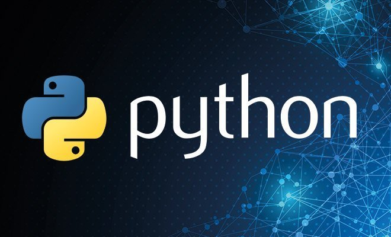

<!--
layout: workshop
titel: Python Flask Restful Api
social-media-untertitel: Asynchronen Workshop
datum: 2021-06-22
modul: wt
autor: Javad Alamdar
bild: ../pyhton.jpg
art: workshop
termin: 
dauer: 120-150 Minuten 
raum: https://th-koeln.zoom.us/j/89337586017?pwd=L2hBbmczaWJ6TStkUjMxTHlRc0ZhUT09
-->



# Restful Api mit Flask in Python

Coach: Javad Alamdar<br>
Dauer: 120-150 Minuten<br>
Termin: Asynchronen Workshop<br>

---

Diese Repository beinhaltete die Materialien für den Workshop ["Restful API mit Flask in Python"](https://javadalam.github.io/WT_Workshop_RestfulApi-mit-/) für den Kurs Webtechnologien im Master Medieninformatik an der TH Köln.

---

In diesem Workshop wird das Thema *Restfull API mit Flask in Python* vorgestellt. Es soll ein Überblick über das Thema gegeben werden und wie man damit umgeht. Mit Hilfe von Übungen sollen die Teilnehmer das vorgestellte Thema innerhalb des Workshops vertiefen können.

Aufgrund dem Anwendungsbereich von *Flask* richtet sich der Workshop stärker an Backend Entwickler. Kenntnisse von *Flask und REST* erleichtern den Einstieg, sind aber keine muss, um mit *Flask in Python* durchzustarten. Am Ende dieses Workshops wird jeder Teilnehmer seine eigene RestAPI mit Flask entwickeln.

---

## Vorraussetzungen
- IDE : [VSCode](https://code.visualstudio.com/download) installieren 
- Browser :  (Im Workshop benutze ich Chrome)


## Vorbereitungen
- [Python](https://www.python.org/downloads/) für VSCode installieren 
- [Postman](https://www.postman.com/downloads/) installieren (Optional)
- [Github Repo zum Workshop](https://github.com/javadalam/WT_Workshop_RestfulApi-mit-) clonen 

## Material
- Python [Dokumentation](https://docs.python.org/3/)
- Flask [Dokumentation](https://flask.palletsprojects.com/en/2.0.x/)
- Postman [Dokumentation](https://learning.postman.com/docs/publishing-your-api/documenting-your-api/)
- [Github Repo mit Übungen](https://github.com/javadalam/WT_Workshop_RestfulApi-mit-Flask-in-Python/tree/main/Aufgaben)
- [Folien](https://github.com/javadalam/WT_Workshop_RestfulApi-mit-Flask-in-Python/tree/main/Folien) 
- [Aufzeichnung](https://github.com/javadalam/WT_Workshop_RestfulApi-mit-Flask-in-Python/tree/main/Aufzeichnungen) herunterladen 


## Welcome to GitHub Pages

You can use the [editor on GitHub](https://github.com/javadalam/WT_Workshop_Rest-API-mit-Flask-in-Python/edit/main/README.md) to maintain and preview the content for your website in Markdown files.

Whenever you commit to this repository, GitHub Pages will run [Jekyll](https://jekyllrb.com/) to rebuild the pages in your site, from the content in your Markdown files.

### Markdown

Markdown is a lightweight and easy-to-use syntax for styling your writing. It includes conventions for

```markdown
Syntax highlighted code block

# Header 1
## Header 2
### Header 3

- Bulleted
- List

1. Numbered
2. List

**Bold** and _Italic_ and `Code` text

[Link](url) and 
```

For more details see [GitHub Flavored Markdown](https://guides.github.com/features/mastering-markdown/).

### Jekyll Themes

Your Pages site will use the layout and styles from the Jekyll theme you have selected in your [repository settings](https://github.com/javadalam/WT_Workshop_Rest-API-mit-Flask-in-Python/settings/pages). The name of this theme is saved in the Jekyll `_config.yml` configuration file.

### Support or Contact

Having trouble with Pages? Check out our [documentation](https://docs.github.com/categories/github-pages-basics/) or [contact support](https://support.github.com/contact) and we’ll help you sort it out.
